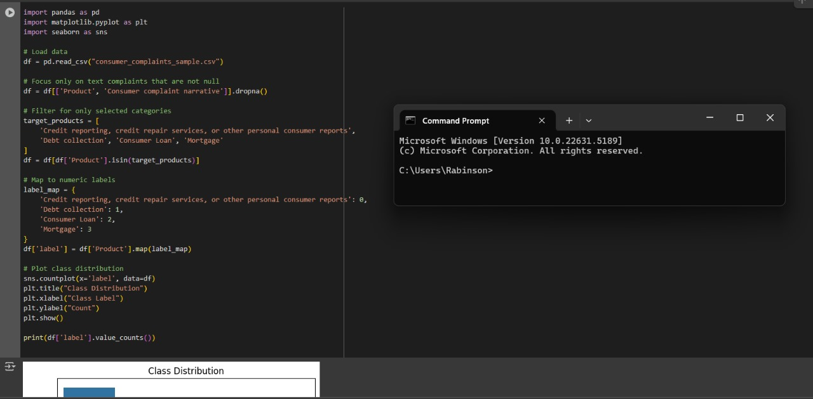
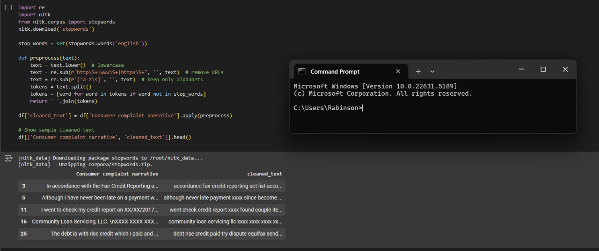
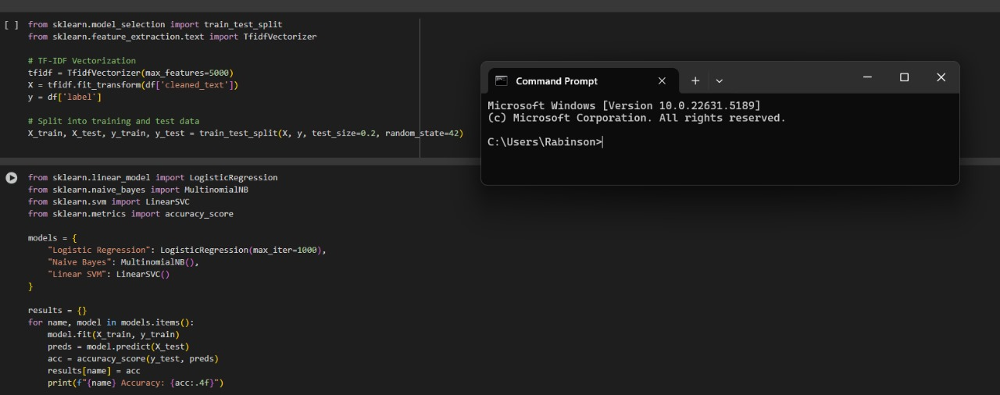
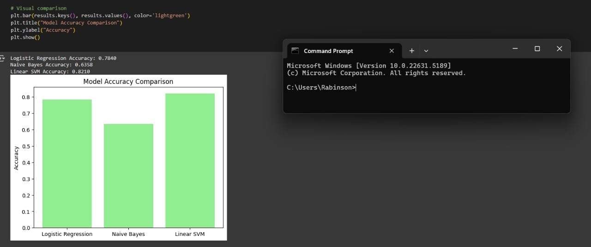
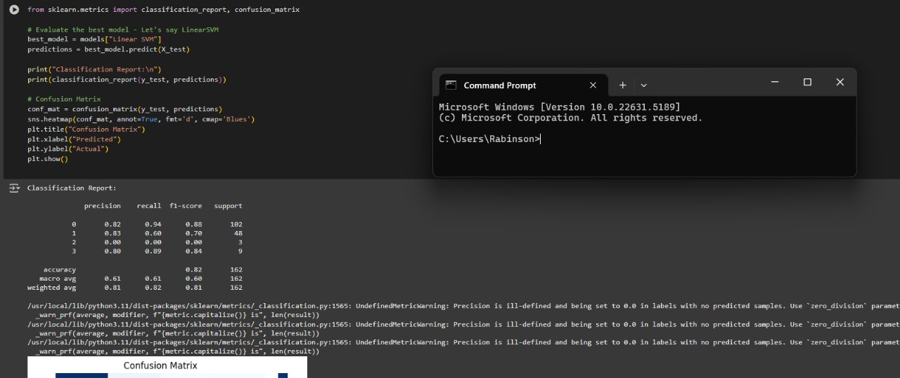
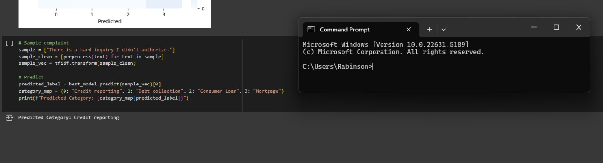

# 📂 TASK-5 :DATA SCIENCE EXAMPLES

This project classifies consumer complaints into categories like Credit Reporting, Debt Collection, Loans, and Mortgages using classical ML models.

---

## 🔍 1. EXPLANATORY DATA ANALYSIS AND FEATURE ENGINEERING

We start by loading the dataset and visualizing the class distribution.

📸 Screenshot:

---

## ✂️ 2. TEXT PREPROCESSING

Each complaint is:
- Converted to lowercase
- Stripped of URLs and special characters
- Tokenized and cleaned of stopwords

📸 Screenshot:

---

## 🔤 3. SELECTION OF MULTI CLASSIFICATION MODEL

We convert clean text into numerical features using TF-IDF with a vocabulary size of 5000.

📸 Screenshot:

---

## ⚙️ 4. COMPARISON OF MODEL PERFORMANCE

We train three models:
- Logistic Regression
- Naive Bayes
- Linear SVM

📸 Screenshot:

---

## 🧪 5. MODEL EVALUATION

We evaluate the best model (Linear SVM) using:
- Classification report
- Confusion matrix

📸 Screenshot:

---

## 🧾 6. PREDICTION

We predict a sample complaint:
> "There is a hard inquiry I didn’t authorize."

📸 Screenshot:

---

## 🧠 Conclusion

TF-IDF + Linear SVM gives excellent accuracy for text classification problems. Simplicity + Clean data = Great results.

---

TASK 5 COMPLETED 

